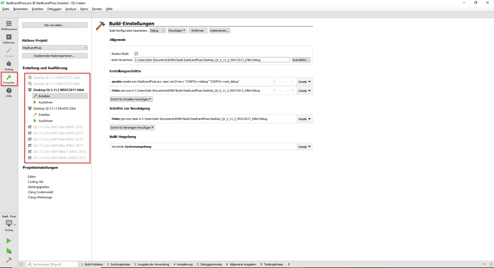
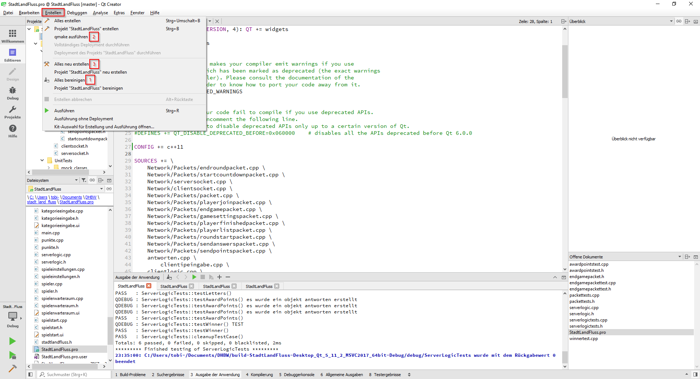

# Stadt Land Fluss
## Ziele
Mehrere Spieler können über das Internet zusammen Stadt Land Fluss spielen. Dazu wird das Programm auf dem Rechner gestartet, 
der als Host dienen soll. Im Fenster, welches sich daraufhin öffnet, gibt der Spieler zuerste seinen Namen ein und drückt auf den 
Button "Spiel hosten"

In den darauffolgenden Fenstern hat er die Möglichkeit Spieleinstellungen vorzunehmen und die Kategorien einzugeben. Ist er damit fertig,
zeigt ein neues Fenster alle verbunden Spieler.

Die anderen Spieler können nun auch ihr Spiel starten und drücken den Button "Spiel beitreten". In dem sich öffnenen Fenster wird nun die IP-Adresse
des Hosts eingebeben.

Sind alle Spieler verbunden, kann der Host über sein Fenster das Spiel starten. Daraufhin öffnet sich bei allen Spieler das Hauptspielfenster.

Hier wird links jeweils der Buchstabe angzeigt und oben die Kategorien. Nun geben die Spieler ihre Antworten ab. In der Leiste ganz oben wird
die verbleibende Zeit angzeigt. Mit einem Klick auf "Fertig" haben alle Spieler nur noch 10s Zeit ihre restlichen Antworten einzutippen, danach
werden die Antworten an den Server geschickt, ausgewertet und in der rechten Spalte angezeigt. Ist die eingestellte Rundenzahl gespielt worden,
sehen die Spieler in einem extra Fenster die Rangliste

## Erstellen des Projektes
Zum Erstellen der lauffähigen Binaries wird das Qt Framework gebraucht. Dieses kann von folgender Seite gedownloaded werden: 
https://www.qt.io/download-qt-installer

Das Projekt wurde mit der Version Qt 5.11 erstellt. Als IDE wurde der Qt Creator benutzt an welchem die Vorhergensweise für das 
Erstellen der Binaries erklärt wird.

Nachdem das Projekt mit dem Qt Creator geöffnet wurde, muss erste eine gültige Einstellung für das Erstellen ausgewählt werden.
Unter Projekte->Erstellung und Ausführung die gewünschte Einstellung mit Doppelklick aktivieren, falls diese noch nicht aktiviert Ist



Nachdem dies geschehen ist kann unter Editieren->StadtLandFluss.pro das gewünschte Target ausgewählt werden. Dazu wird 
in der CONFIG Variable der Name des Targets gesetzt. Folgende Möglichkeiten existieren:
* ```CONFIG += c++11``` erstellt das Spiel selber
* ```CONFIG += c++11 PacketTests``` Erstellt die ausführbare Datei für die automatisiereten Unittests der Pakete
* ```CONFIG += c++11 ServerLogicTests``` Erstellt die Ausführbare Datei für die automatisiereten Unittests der Serverlogik

Nach jeder Änderung in der StadtLandFluss.pro müssen folgende Schritte in der angegeben Reihenfolge gemacht werden
um zu gewährleisten, dass alles richtig erstellt wird:



## Dokumentation
Im Ordner html finden sich die generierten Doxygen Dateien. Dazu einfach die index.html aufrufen.
Eine Doxygen-Datei ist im Projekt enthalten, sodass durch den Aufruf von ```doxygen``` auch alle Dateien neu generierten
werden können